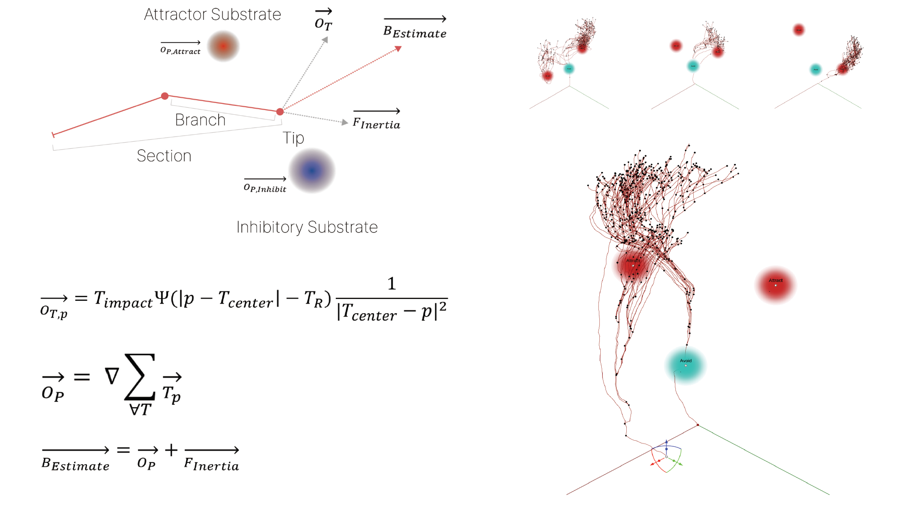

# Binary Fungi 

## 0. Reference Paper

## 1. Neighbor Sensing Model
The Neighbour-Sensing model is a mathematical model that simulates the growth of fungal hyphae in three dimensions. It can be used to study the growth of fungal colonies. The model includes a measurement and logging system to track the growth of the mycelium, as well as the ability to simulate the effects of different substrates and tropisms on fungal growth. The Neighbour-Sensing model can be used to investigate hyphal growth kinetics, which can be useful for studying scenarios that would be difficult or impractical to study in vivo.

   

   
